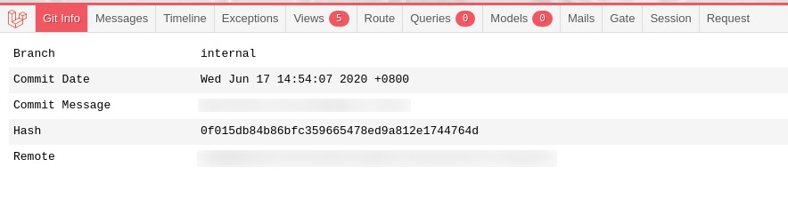

# Laravel Debugbar Git Info

Add your project's Git information in your Laravel Debugbar.



## Installation

Simply add the package to your `composer.json` and you're good to go!

```bash
composer require coreproc/laravel-debugbar-git-info --dev
```

## About CoreProc

CoreProc is a software development company that provides software development services to startups, digital/ad agencies, and enterprises.

Learn more about us on our [website](https://coreproc.com).

## Credits

- [Chris Bautista](https://github.com/chrisbjr)
- [All Contributors](../../contributors)

## License

The MIT License (MIT). Please see [License File](LICENSE.md) for more information.
